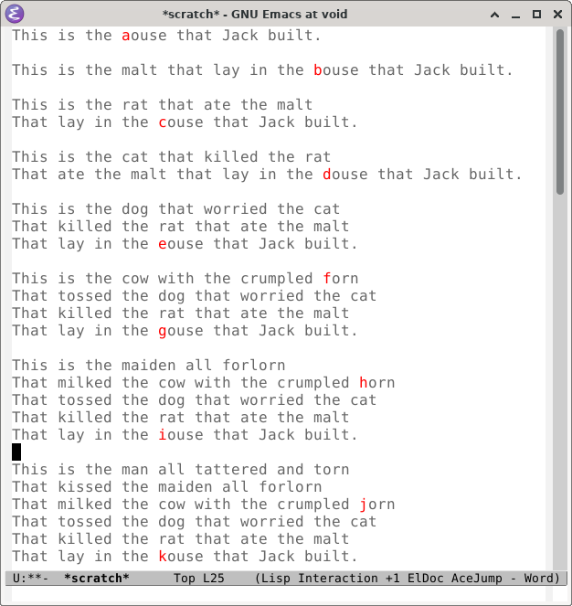

Ace Jump Mode
=============

[](https://www.gnu.org/software/emacs/)
[](LICENSE)
[](https://melpa.org/#/ace-jump-mode)
[](https://stable.melpa.org/#/ace-jump-mode)
[](https://github.com/winterTTr/ace-jump-mode/actions/workflows/test.yml)

Ace jump mode is a minor mode of Emacs, which helps you to move the
cursor within Emacs.  You can move your cursor to **ANY** position
(across windows and frames) in Emacs by using only **3 key presses**.
Have a try and I am sure you will love it.




Usage
-----

With the keys from [Installation](#installation):

`M-a` ==> `ace-jump-word-mode`

> Go to a word by entering its first character, then selecting the
> highlighted key to move to it.  Go to a line by pressing `RET`
> instead of a character.

`C-u M-a` ==> `ace-jump-char-mode`

> Go to a character by entering that character, then selecting the
> highlighted key to move to it.

`C-u C-u M-a` ==> `ace-jump-line-mode`

> Go to a line by selecting the highlighted key to move to it.

`C-c M-a` ==> `ace-jump-mode-pop-mark`

> Jump back to where the last jump started.  Repeat it to go further
> back.

When there are more candidates than keys, the first key narrows the
choice, and a second one jumps.  An upper case character searches
case-sensitively.

Watch [Emacs Rocks! Episode 10: Jumping
around](https://www.youtube.com/watch?v=UZkpmegySnc) to see it in
action.


Installation
------------

Install ace-jump-mode from [MELPA](https://melpa.org/#/ace-jump-mode),
for instance with `use-package`:

```elisp
(use-package ace-jump-mode
  :ensure t
  :bind (("M-a" . ace-jump-mode)               ; instead of `backward-sentence'
         ("C-c M-a" . ace-jump-mode-pop-mark))
  :config
  (ace-jump-mode-enable-mark-sync))
```

To follow the latest commit instead, replace `:ensure t` in Emacs 30
or later with

```elisp
:vc (:url "https://github.com/winterTTr/ace-jump-mode" :rev :newest)
```

or, with [straight.el](https://github.com/radian-software/straight.el),
with

```elisp
:straight (:host github :repo "winterTTr/ace-jump-mode")
```

Any other free keys will do as well, `C-c j` for one.
`ace-jump-mode-enable-mark-sync` keeps `ace-jump-mode-pop-mark` in sync
with the Emacs mark rings, and the other way round.

If you use evil or viper:

```elisp
(define-key evil-normal-state-map (kbd "SPC") 'ace-jump-mode)
(define-key viper-vi-global-user-map (kbd "SPC") 'ace-jump-mode)
```


Customization
-------------

`M-x customize-group RET ace-jump RET` lists the options: the move
keys, the scope of a jump (all the windows of all the frames by
default, or the selected window only), case sensitivity and so on.
See also the [FAQ](https://github.com/winterTTr/ace-jump-mode/wiki/AceJump-FAQ)
in the wiki.

The labels use the face `ace-jump-face-foreground`, and the grayed
text `ace-jump-face-background`.  If they don't suit your color theme
or terminal, change them with `M-x customize-face`, or leave the text
as it is with `(setq ace-jump-mode-gray-background nil)`.

In a [ghostel](https://github.com/dakra/ghostel) terminal, a jump has
to leave the live input, or the next redraw takes point back to the
terminal cursor.  Leaving it may take point back as well, so restore
it afterwards:

```elisp
(add-hook 'ace-jump-mode-end-hook
          (lambda ()
            (when (derived-mode-p 'ghostel-mode)
              (let ((target (point)))
                (ghostel-maybe-leave-input)
                (goto-char target)))))
```


License
-------

Copyright © 2011-2026 winterTTr <winterTTr@gmail.com>
and [contributors](https://github.com/winterTTr/ace-jump-mode/graphs/contributors?from=6%2F27%2F2011)

Distributed under the [GNU General Public License 3.0+](LICENSE)
